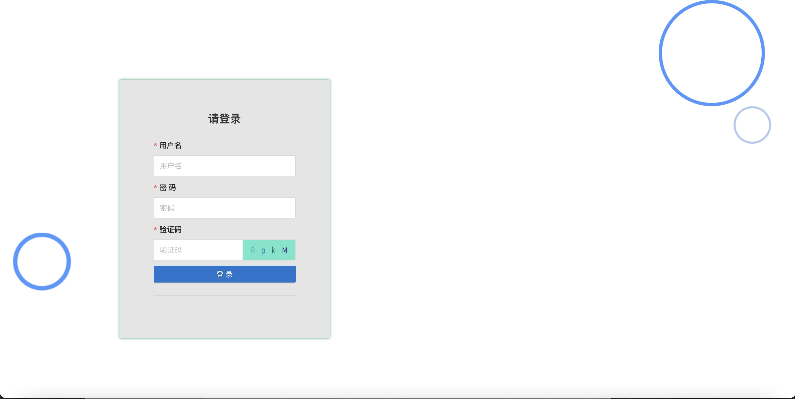
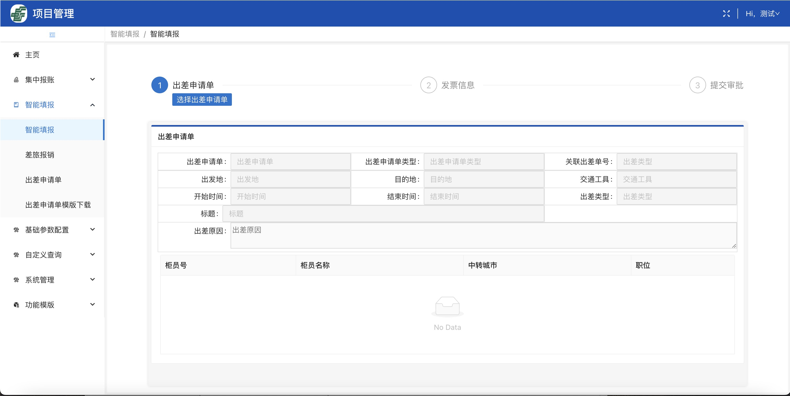

# Getting Started with Create React App

## 描述
> Node 版本 V12.22.7 及以上

 颜色描述
 - success: #53c31b
 - primary: #1990ff
 - warning: #faac14
 - error: #ff4d4e
 
 常用图标描述：

| 左对齐 |   右对齐 |
| :-----|------:|
| PlusSquareOutlined |    新建 |
| DeleteOutlined |    删除 |
| CloseSquareOutlined |    关闭 |
| PlayCircleOutlined |    开始 |
| LogoutOutlined | 关机，退出 |
| FormOutlined |    编辑 |
| ReloadOutlined |    重置 |
| SearchOutlined |    查询 |

### 常用指令

#### 项目启动 `yarn start`

#### 编译 `yarn build`

#### 读取配置文件 `yarn eject`
